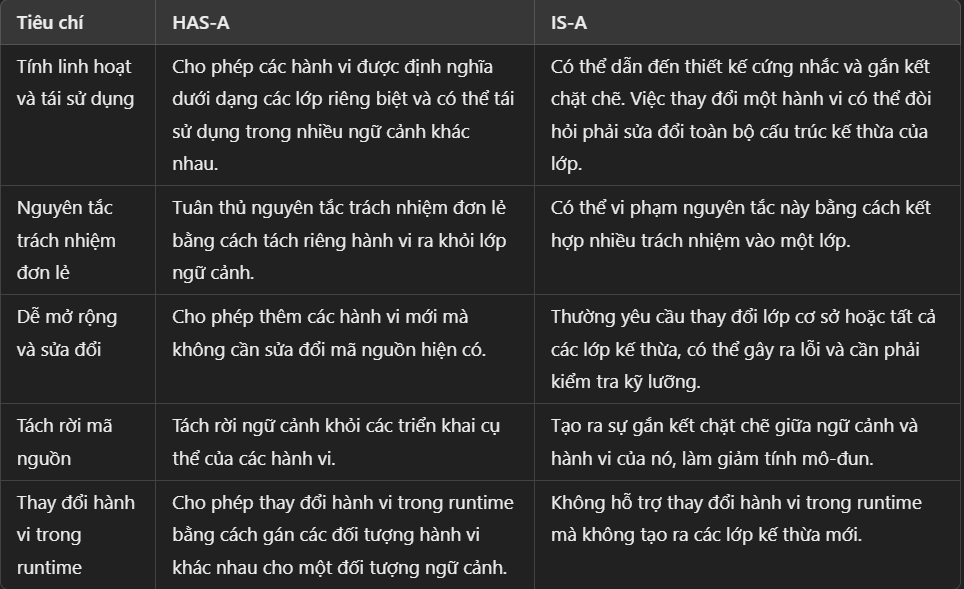

Tổng kết Strategy pattern:
    + Định nghĩa, đóng gói lại những algorithms có chung 1 mục đích (hoặc chung 1 cái gì đó)
    =>  làm cho chúng có thể thay thế được cho nhau.
    + Cho phép các algorithms thay đổi độc lập với client sử dụng nó.

    + HAS-A sẽ tốt hơn IS-A.
    + So sánh has-a và is-a
        

